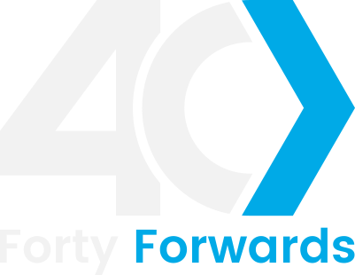
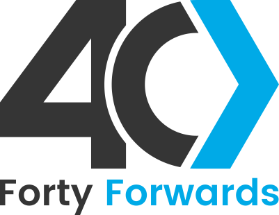
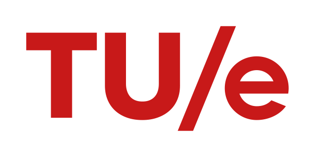

More details can be found on [LinkedIn](https://www.linkedin.com/in/bramhooimeijer/).

## Work experience
<table class="resume-table">
  <thead>
    <tr>
      <th class="f20-column"></th>
      <th class="f20-column">Company</th>
      <th>Role</th>
      <th class="f20-column">Dates</th>
    </tr>
  </thead>
  <tbody>
    <tr>
      <td></td>
      <td><a href="https://fortyforwards.com">Forty Forwards</a></td>
      <td>Entrepreneur & Contractor</td>
      <td>2024-present, Eindhoven, NL</td>
    </tr>
    <tr>
      <td rowspan="3"></td>
      <td rowspan="3"><a href="https://prodrive-technologies.com/">Prodrive Technologies</a></td>
      <td>Technical Director</td>
      <td>2022-2024, Eindhoven, NL</td>
    </tr>
    <tr>
      <td> Architect</td>
      <td>2021, Eindhoven, NL</td>
    </tr>
    <tr>
      <td> Software Engineer</td>
      <td>2020, Eindhoven, NL</td>
    </tr>
    <tr>
      <td></td>
      <td><a href="https://www.asml.com">ASML</a></td>
      <td>Research Intern</td>
      <td>2019-2020, Eindhoven, NL</td>
    </tr>
    <tr>
      <td></td>
      <td><a href="https://www.arm.com">Arm</a></td>
      <td>Hardware Verification Intern</td>
      <td>2019, Cambridge, UK</td>
    </tr>
  </tbody>
</table>

## Education
<table class="resume-table">
  <thead>
    <tr>
      <th class="f20-column"></th>
      <th class="f20-column">University</th>
      <th>Program</th>
      <th class="f20-column">Dates</th>
    </tr>
  </thead>
  <tbody>
    <tr>
      <td rowspan="3"></td>
      <td rowspan="3"><a href="https://www.tue.nl/en/">Eindhoven University of Technology</a></td>
      <td>MSc. Embedded Systems</td>
      <td>2017-2020</td>
    </tr>
    <tr>
      <td>MSc. Electrical Engineering</td>
      <td>2017-2020</td>
    </tr>
    <tr>
      <td>BSc. Electrical Engineering</td>
      <td>2013-2016</td>
    </tr>
  </tbody>
</table>